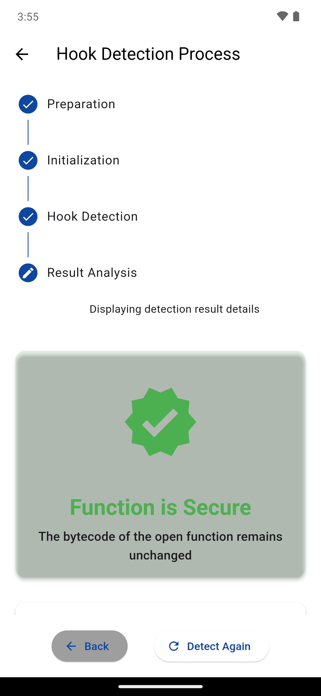
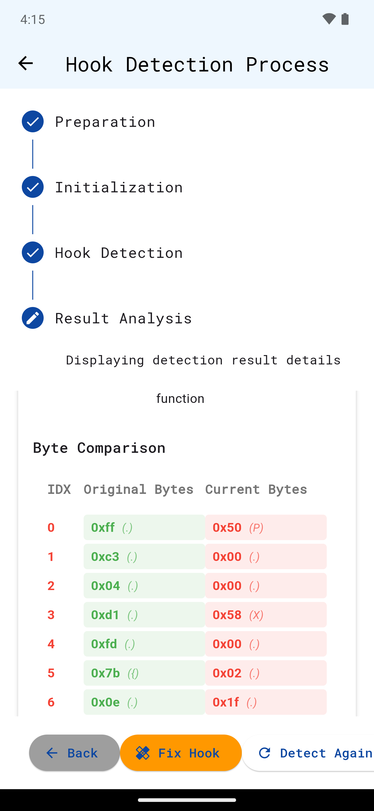

# memwatch

## 概要

memwatch は、seccompフィルターとptraceを使用してAndroid ARM64プログラムのプログラム領域の自己改変をリアルタイムで検出することを実証します。このツールは以下の考え方・方法でメモリ保護の変更を監視し、自己改変の試みをリアルタイムに検出します。また検出するだけでなく、該当の自己改変を無効化することも可能です。

本ツールは、第 87 回情報処理学会全国大会「**Frida による動的関数呼び出し追跡の検出および回避手法の Android 環境への拡張検討**」の論文に対する PoC として開発されました。

## 特徴

- **W^X 方針の選択的制御**: メモリの書き込み・実行権限の変更を監視し、許可・拒否を細かく制御
- **リアルタイム介入**: プロセスの自己改変試行をリアルタイムに検出し介入
- **2 つの対応モード**:
  - スキップモード: 自己改変コードをスキップして無効化
  - 制御モード: 一時的に権限を付与して単一命令を実行後に保護を復元
- **ホワイトリスト対応**: FridaのInterceptor.attachなど、信頼できる関数の例外処理をサポート（mprotect呼び出しを2回まで許可）

## プロジェクト構成

### 主要コンポーネント

1. **memwatch.cpp** - C++実装のデバッガコンポーネント
   - ptrace を使用したプロセス監視
   - SIGSEGV シグナルハンドリング
   - メモリ保護の制御と管理

2. **install_seccomp.js** - Frida スクリプト
   - seccomp フィルターの設定
   - ホワイトリスト機能の登録
   - デバッガとの通信確立

## 実行

### 前提条件

- ADB (Android Debug Bridge)
- ルート権限のある Android デバイス
- Frida CLI

### セットアップ手順

ファイルをデバイスに転送 & 実行権限の付与
```bash
adb push memwatch /data/local/tmp
adb shell chmod a+x /data/local/tmp/memwatch
```

テスト用アプリケーションのインストール
```bash
adb install app-release.apk
```

frida-serverの起動
```bash
adb shell
$ su
$ cd /data/local/tmp
$ ./frida-server
```

### 動作検証パターン

テスト用アプリ`hook_detector`は「Start Detection」ボタンで`libc.so`の`open`関数が改竄されているかを検証します。  
またアプリ上で「Fix Hook」ボタンを押すと、open関数をオリジナルのバイトコードに書き戻す機能を有しています。



#### パターン1: Fridaフックのみ（memwatchなし）

このパターンでは、Fridaによるopen関数のフックが正常に機能し、hook_detectorによって検出されます。

1. **Fridaでフックを適用してStart Detectionを実行**:

```bash
frida -U -f com.chillstack.hook_detector -l frida/open_hook.js
 ```

下記のようにフックは検知されます。


また「Fix Hook」ボタンによってコードはオリジナルに書き戻され、FridaのInterceptor.attachは無効化されます。


#### パターン2: Anti-Frida保護を解析・制御する場合

このパターンでは、memwatchのseccompフィルタを使って、Anti-Fridaによる自己書き換え保護メカニズムを解析・制御します。

1. **memwatchをバックグラウンドで起動**:
 ```bash
adb shell
$ su
$ cd /data/local/tmp
# スキップモード（自己書き換えを無効化）
$ ./memwatch -s &
 ```

2. **Fridaでフックを適用してStart Detectionを実行**:
 ```bash
frida -U -f com.chillstack.hook_detector -l frida/install_seccomp.js -l frida/open_hook.js
 ```

下記のようにフックは検知されます。


ただし今回は「Fix Hook」ボタンを押してもコードは改竄された状態のままで、FridaのInterceptor.attachは有効化されたままになります。



## 仕組みの解説

### 検知フロー

1. **初期セットアップ**:
   - Frida スクリプトが seccomp フィルターをインストール
   - デバッガが ptrace でプロセスに接続
   - TCP 通信でホワイトリスト情報を共有（Interceptor.attachで使われるアドレスなど）

2. **seccomp トラップによる権限変更検知**:
   - プロセスが mprotect で書き込み・実行権限を要求
   - seccomp フィルターがトラップして通知
   - デバッガがメモリ保護変更を選択的に制御（ホワイトリストアドレスは許可、その他は制限）

3. **SIGSEGV 処理による書き込み試行の検知**:
   - 保護されたメモリへの書き込みで SIGSEGV が発生
   - デバッガがシグナルを捕捉
   - 設定したモードに応じて制御（スキップ/制御）


## 重要な特徴

- memwatchはFridaフック自体を無効化するのではなく、Anti-Fridaによる自己書き換え保護メカニズムを解析・制御するツールです
- FridaのInterceptor.attachなどホワイトリストに登録されたアドレスに対しては、mprotect呼び出しを2回まで許可します（Interceptor.attachは初期化時に2回のmprotect呼び出しを行うため）
- 自己書き換えコードの動作を解析するために、SIGSEGVをリアルタイムに捕捉して介入します

## 応用例

- **セキュリティ研究**: Anti-Frida/Anti-Hook保護技術の評価と解析
- **マルウェア解析**: 自己改変型マルウェアの動作分析

## 制限事項

- ルート権限が必要
- カーネルやハードウェアの制限による影響
- FridaのInterceptor.replacementなど一部の高度なフック手法に対応していない場合があります

## ライセンス

Apache License 2.0
