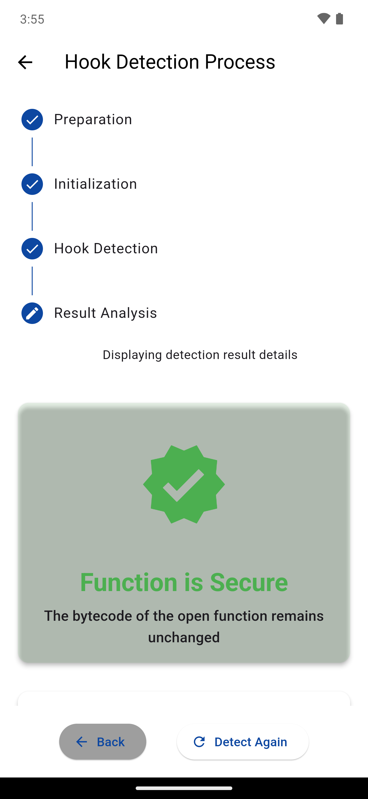
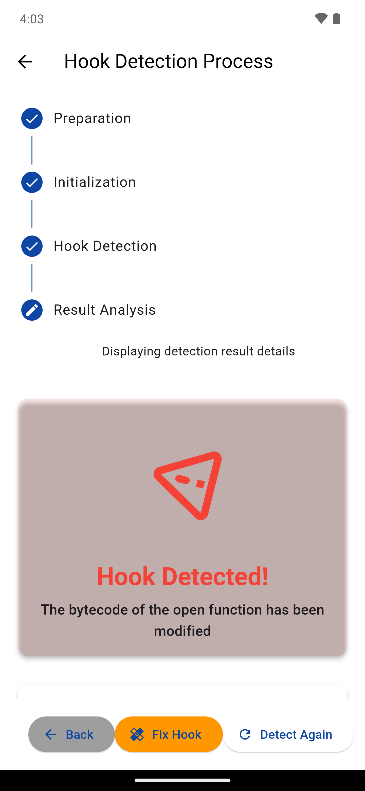
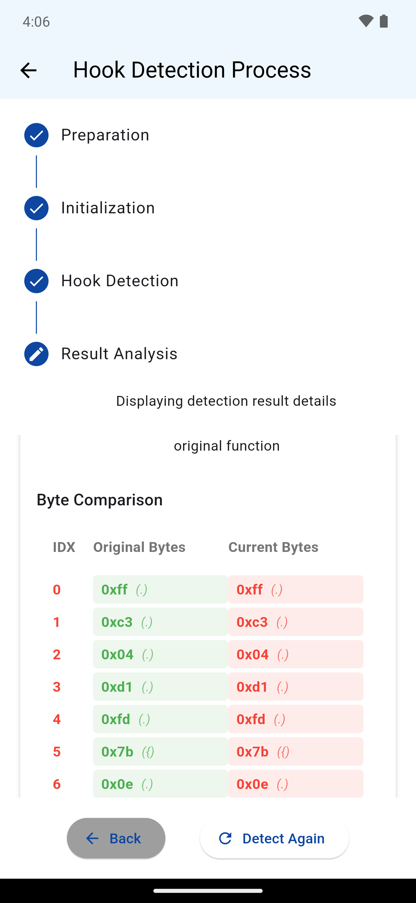
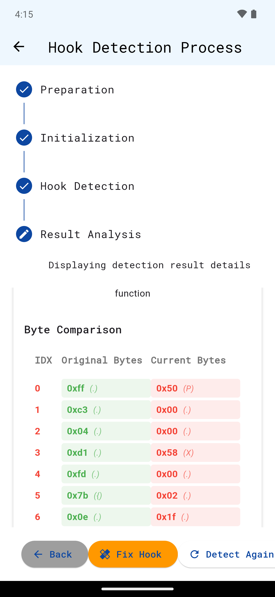

# memwatch

## Overview
memwatch demonstrates real-time detection of self-modification in Android ARM64 program code regions using seccomp filters and ptrace. This tool monitors memory protection changes and detects self-modification attempts in real-time. Additionally, it can not only detect but also disable such self-modifications.

This tool was developed as a Proof of Concept (PoC) for the paper **"Extension of Detection and Avoidance Methods for Dynamic Function Call Tracing by Frida to Android Environment"** presented at the 87th Information Processing Society of Japan National Convention.

[日本語のREADMEはここ](https://github.com/chillstack-inc/memwatch/blob/master/README.ja.md)

## Features
- **Selective Control of W^X Policy**: Monitors and finely controls write/execute permission changes in memory
- **Real-time Intervention**: Detects and intervenes in process self-modification attempts in real-time
- **Two Response Modes**:
  - Skip Mode: Disables self-modifying code by skipping it
  - Control Mode: Temporarily grants permissions to execute a single instruction before restoring protection
- **Whitelist Support**: Handles exceptions for trusted functions like Frida's Interceptor.attach (allows up to two mprotect calls)

## Project Structure
### Main Components
1. **memwatch.cpp** - C++ debugger component
   - Process monitoring using ptrace
   - SIGSEGV signal handling
   - Memory protection control and management
2. **install_seccomp.js** - Frida script
   - seccomp filter configuration
   - Whitelist function registration
   - Communication establishment with the debugger

## Execution
### Prerequisites
- ADB (Android Debug Bridge)
- Rooted Android device
- Frida CLI

### Setup
Transfer files to device & grant execution permissions
```bash
adb push memwatch /data/local/tmp
adb shell chmod a+x /data/local/tmp/memwatch
```
Install test application
```bash
adb install app-release.apk
```

Run frida-server
```bash
adb shell
$ su
$ cd /data/local/tmp
$ ./frida-server
```


### Verification Patterns
The test app `hook_detector` verifies whether the `open` function in `libc.so` has been tampered with by pressing the "Start Detection" button.
The app also has a "Fix Hook" button that restores the open function to its original bytecode.



#### Pattern 1: Frida Hook Only (without memwatch)
In this pattern, Frida's hook on the open function works normally and is detected by hook_detector.
1. **Apply Frida hook and run Start Detection**:
```bash
frida -U -f com.chillstack.hook_detector -l frida/open_hook.js
```
The hook is detected as shown below:



Moreover, the "Fix Hook" button restores the code to its original state, disabling Frida's Interceptor.attach.



#### Pattern 2: Analyzing and Controlling Anti-Frida Protection
In this pattern, memwatch's seccomp filter is used to analyze and control the Anti-Frida self-modification protection mechanism.
1. **Launch memwatch in the background**:
```bash
adb shell
$ su
$ cd /data/local/tmp
# Skip mode (disable self-modification)
$ ./memwatch -s &
```
2. **Apply Frida hook and run Start Detection**:
```bash
frida -U -f com.chillstack.hook_detector -l frida/install_seccomp.js -l frida/open_hook.js
```
The hook is detected as shown below:


However, in this case, even after pressing the "Fix Hook" button, the code remains in its modified state, and Frida's Interceptor.attach remains active.



## Technical Explanation
### Detection Flow
1. **Initial Setup**:
   - Frida script installs seccomp filter
   - Debugger connects to the process using ptrace
   - Whitelist information is shared via TCP communication (addresses used by Interceptor.attach, etc.)
2. **Permission Change Detection via seccomp Trap**:
   - Process requests write/execute permissions with mprotect
   - seccomp filter traps and notifies
   - Debugger selectively controls memory protection changes (allows whitelist addresses, restricts others)
3. **Write Attempt Detection via SIGSEGV Handling**:
   - SIGSEGV occurs on write attempts to protected memory
   - Debugger captures the signal
   - Controls based on configured mode (skip/control)


## Key Features
- memwatch is a tool for analyzing and controlling Anti-Frida self-modification protection mechanisms, not for disabling Frida hooks themselves
- For addresses registered in the whitelist, such as Frida's Interceptor.attach, up to two mprotect calls are allowed (Interceptor.attach makes two mprotect calls during initialization)
- To analyze self-modifying code behavior, SIGSEGV is captured and intervened in real-time

## Applications
- **Security Research**: Evaluation and analysis of Anti-Frida/Anti-Hook protection techniques
- **Malware Analysis**: Behavioral analysis of self-modifying malware

## Limitations
- Requires root privileges
- May be affected by kernel or hardware limitations
- May not support some advanced hooking techniques like Frida's Interceptor.replacement

## License
Apache License 2.0
